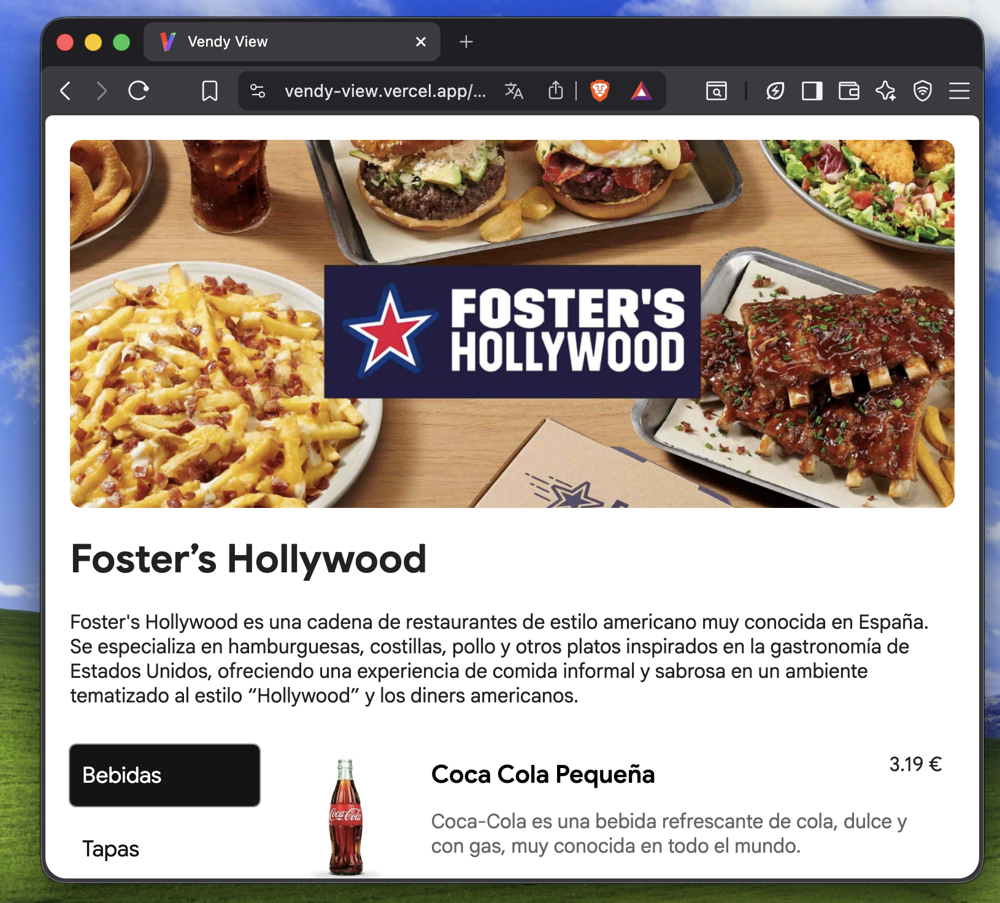

# Vendy-view

Web moderna para mostrar los productos creados en la aplicación web de Vendy. Este sistema se utiliza para mostrar los productos tanto en la aplicación de escritorio como en web, desarrollada mediante React y Vite.

<p align="left">
  <a href="https://vendy-view.vercel.app/?email=ejemplopublico@vendy.com">
    
  </a>
  <a href="https://github.com/Wyxemon/Vendy-view/blob/main/README-eus.md">
    
  </a>
</p>




##  Instalación y ejecución

```bash
# 1. Clona el repositorio
git clone https://github.com/Wyxemon/Vendy-view

# 2. Entra en la carpeta del proyecto
cd Vendy-view

# 3. Instala las dependencias
npm install

# 4. Inicia el servidor de desarrollo
npm run dev
```

##  Tecnologías

- **React** — Biblioteca de interfaz de usuario
- **Vite** — Bundler y servidor de desarrollo
- **Firebase** — Backend y base de datos en tiempo real